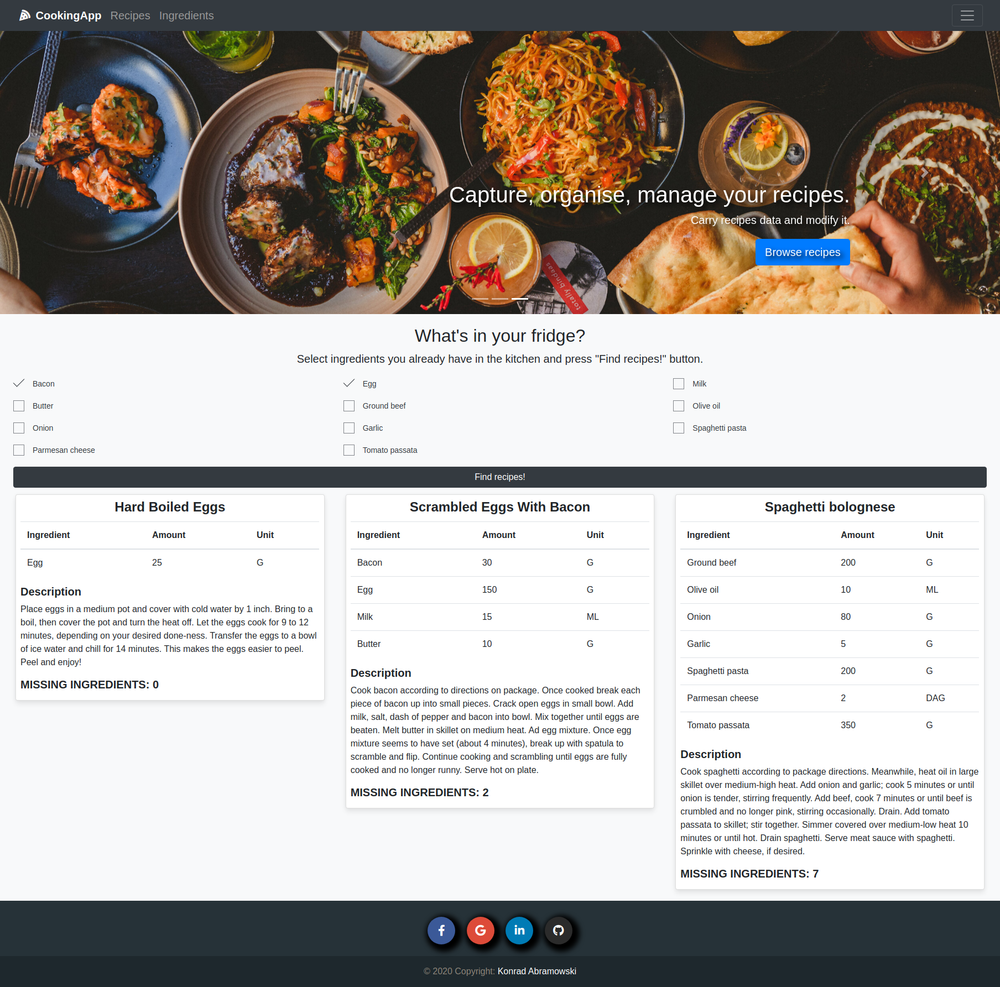
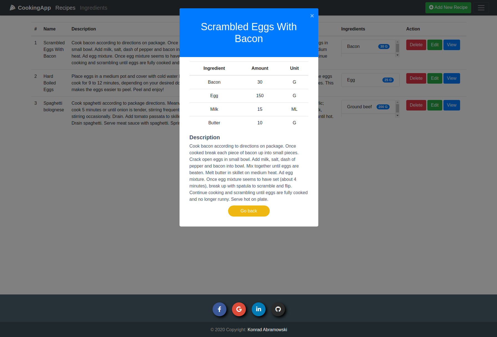
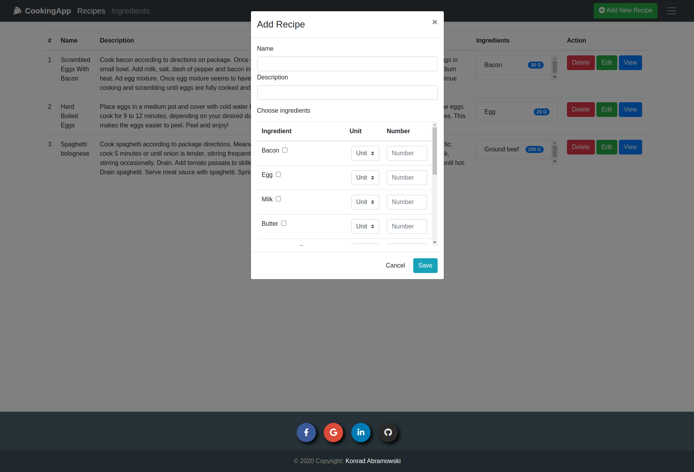

# CookingApp
Web application for finding recipes for ingredients you already have in your kitchen


## Table of Contents

- [Getting Started](#getting_started)
- [Screenshots](#screenshots)

## Getting Started (Ubuntu) <a name = "getting_started"></a>

These instructions will get you a copy of the project up and running on your local machine for development and testing purposes.


### Prerequisites

Make sure Java is already installed on your machine:


```
java -version
```

If Java is not currently installed,
 you’ll see the following output:

```
Command 'java' not found, but can be installed with:

apt install default-jre
apt install openjdk-11-jre-headless
apt install openjdk-8-jre-headless
```

In such a case, execute the following command:

```
sudo apt install default-jdk
```

### Installing 

Execute the following commands:
```
$ cd <place-you-want-to-store-cookingapp>
$ git clone https://github.com/Konrad-Abramowski/CookingApp.git
$ cd CookingApp
$ ./mvnw spring-boot:run
```

CookingApp will be running under the address:
```
http://localhost:8080
```

## Screenshots <a name = "Screenshots"></a>









