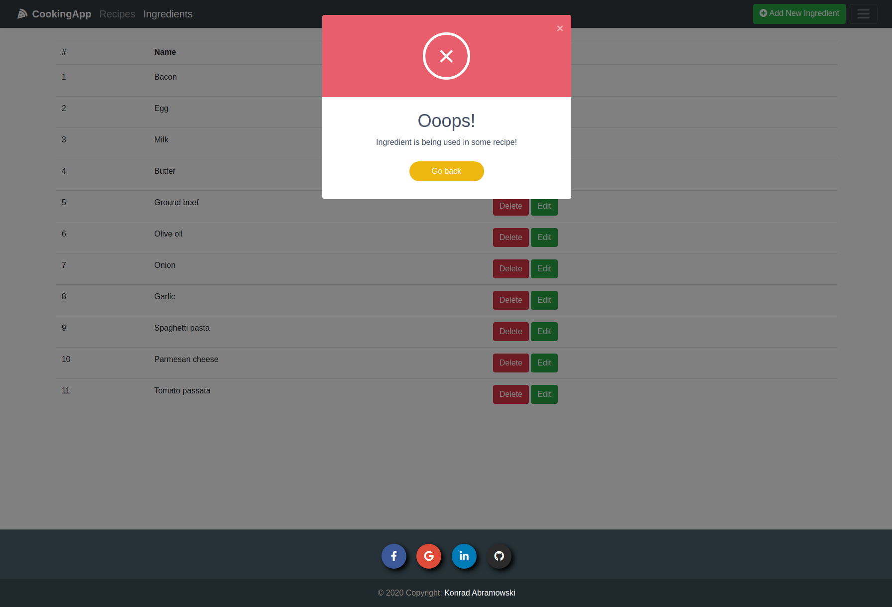

# CookingApp
Web application for finding recipes for ingredients you already have in your kitchen


## Table of Contents

- [Getting Started](#getting_started)
- [Screenshots](#screenshots)

## Getting Started (Ubuntu) <a name = "getting_started"></a>

These instructions will get you a copy of the project up and running on your local machine for development and testing purposes.


### Prerequisites

<br/>`docker with docker-compose` https://docs.docker.com/get-docker/

### Installing 

Execute the following commands:
```
$ cd <place-you-want-to-store-cookingapp>
$ git clone https://github.com/Konrad-Abramowski/CookingApp.git
$ cd CookingApp
$ sudo docker-compose up -d
```

CookingApp will be running under the address:
```
http://localhost:8080
```

If you want to close the application, use:
```
$ sudo docker-compose down
```

## Screenshots <a name = "Screenshots"></a>




